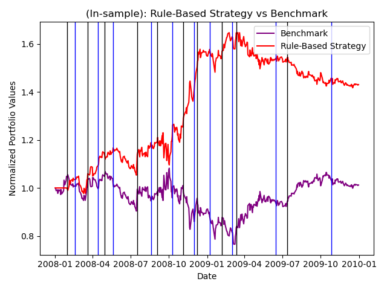
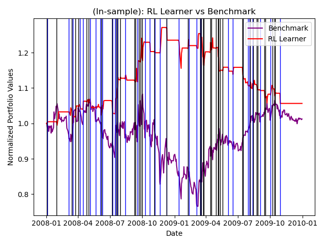
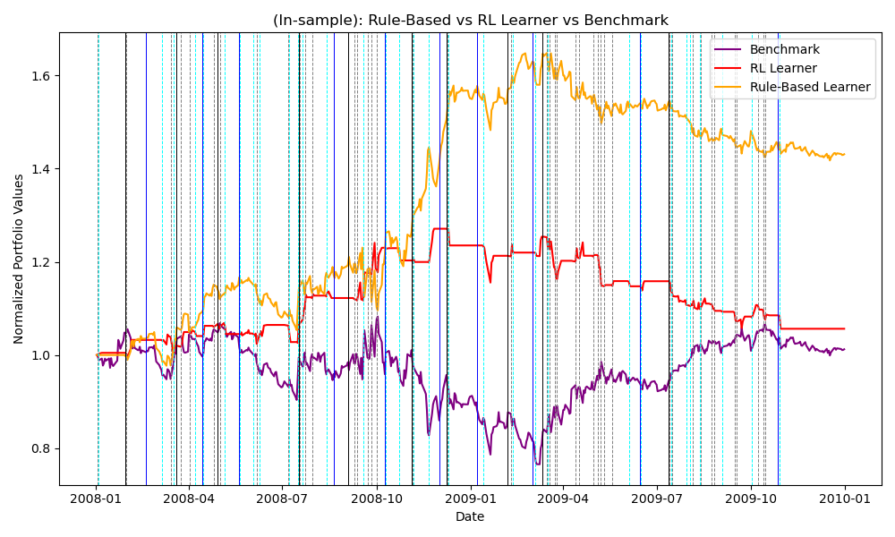
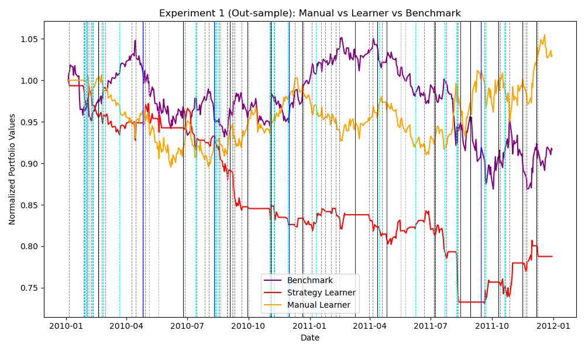
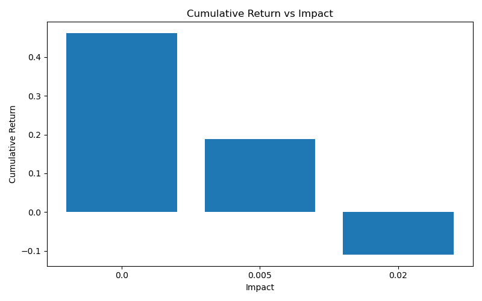
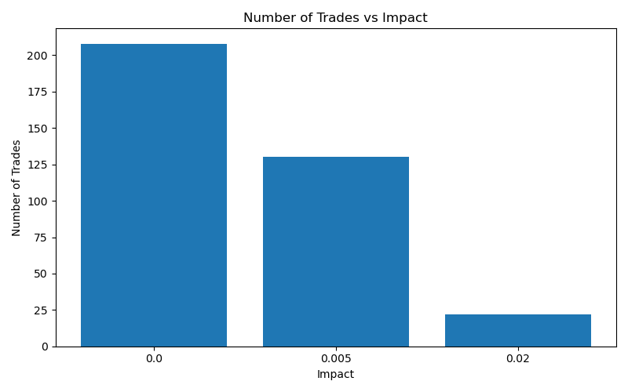

# Q-Learning Reinforcement Learning Trading Agent
A reinforcement learning–based trading system that learns long, short, and neutral positions using **tabular Q-learning** over a discretized technical-indicator state space. The project includes a **custom state/action design**, a **rule-based baseline**, a **backtesting engine**, and **controlled experiments** analyzing performance and market impact.

## Project Overview
Traditional rule-based trading strategies rely on fixed heuristics that often fail to generalize across market regimes. This project explores whether a reinforcement learning agent can instead learn an effective trading policy directly from market data.

The agent observes market conditions through discretized technical indicators and learns a policy that maximizes long-term portfolio returns while accounting for transaction costs and market impact.

## Key Features

#### Tabular Q-Learning
- ε-greedy exploration with decay  
- Bellman update with optional Dyna-Q planning  

#### Custom State Space
- Holdings state: `{short, flat, long}`  
- Indicator bins from:
  - Bollinger Band Percentage (BBP)
  - Relative Strength Index (RSI)
  - MACD  

#### Action Space
- `{short 1000 shares, hold, long 1000 shares}`  

#### Market Frictions
- Commission costs  
- Market impact modeled via adverse price movement  

#### Baselines & Comparisons
- Rule-based (manual) strategy  
- Buy-and-hold benchmark

## State Representation

Each state is encoded as a unique integer derived from:

```ini
State = Holdings × (Bins³) + BBP × (Bins²) + RSI × (Bins¹) + MACD
```
Where:
```Holdings ∈ {0, 1, 2} → short / flat / long```

```Bins = 3``` per indicator

This produces 81 distinct states, allowing efficient learning while preserving interpretability.

## Strategies Implemented
1. Q-Learning Trading Agent (```RLTradingStrategy.py```)
* Learns an optimal trading policy from historical price data
* Optimizes long-term reward using portfolio returns
* Penalizes excessive trading through transaction costs
2. Rule Based Manual Strategy (```RuleBasedStrategy.py```)
* Uses fixed thresholds on BBP, RSI, and MACD
* Serves as a deterministic comparison baseline
3. Benchmark
* Buy 1000 shares on the first trading day and hold

## Performance Metrics & Results

### Interpreting Trade Annotations

Vertical lines in the performance plots indicate **trade entry points**, showing when a strategy changes position relative to market movements.

### Trade Signal Color Coding
- **Blue vertical lines** → Long entry (+1000 shares)  
- **Black vertical lines** → Short entry (−1000 shares)  

Vertical lines appear **only when positions change** (e.g., flat → long, long → short). Holding periods without trades are intentionally left unmarked to reduce visual clutter.

### Strategy-Specific Annotations (Combined Plots)
When multiple strategies are overlaid:

**Manual Strategy**
- Blue: Long entry  
- Black: Short entry  

**Strategy Learner (Q-Learning Agent)**
- Cyan dashed lines: Long entry  
- Gray dashed lines: Short entry  

These annotations make it easy to compare **trading frequency, aggressiveness, and timing** between the rule-based strategy and the learned policy.

### RL Strategy Performance vs Benchmark Experiment
This experiment compares the rule-based strategy and the RL Learner against a buy-and-hold benchmark in both in-sample and out-of-sample periods. While both strategies outperform the benchmark in-sample, the rule-based strategy achieves higher returns with more stable behavior. Out-of-sample, the RL Learner trades more aggressively and suffers from higher transaction costs, leading to weaker performance, consistent with overfitting to the training period.

#### In-Sample Performance (Training Period)
The Q-Learning agent learns an aggressive but profitable policy relative to the benchmark.





#### Out-of-Sample Performance (Unseen Data)
Performance degrades out-of-sample, highlighting overfitting risk and regime sensitivity (a realistic and important outcome).



---

### Market Impact Sensitivity Experiment

This experiment examines how market impact influences the RL Learner’s behavior. As impact increases, trading becomes more costly, leading the learner to trade less frequently and adopt a more conservative policy. Higher impact reduces cumulative returns by discouraging short-term trades, while low impact enables more aggressive trading and higher returns. At higher impact levels, the learner becomes more selective, occasionally improving performance by focusing on higher-confidence trades.




**Key Observations:**
- Higher market impact → fewer trades  
- Reduced trading frequency lowers cumulative return  
- The agent adapts its behavior based on transaction costs

## Design Tradeoffs & Takeaways
### Discretization vs Expressiveness
* Tabular methods scale poorly but offer interpretability and stability.

#### Overfitting Risk
* Strong in-sample results do not guarantee generalization.

#### Transaction Costs Matter
* Market impact dramatically changes optimal behavior.

## Potential Future Improvements
* Replace tabular Q-learning with Deep Q-Networks (DQN)
* Expand state space with volatility and regime indicators
* Multi-asset portfolio support
* Risk-adjusted reward functions (Sharpe, drawdown penalties)

### **Disclaimer**
This project is for educational and research purposes only and does not constitute financial advice. Past performance is not indicative of future results.
